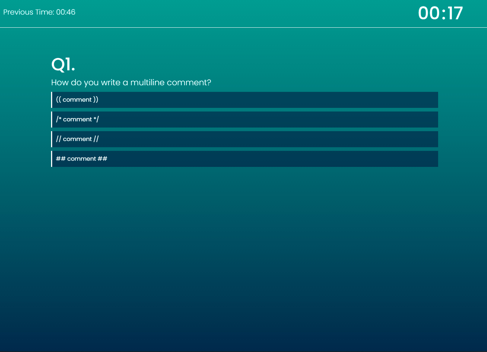
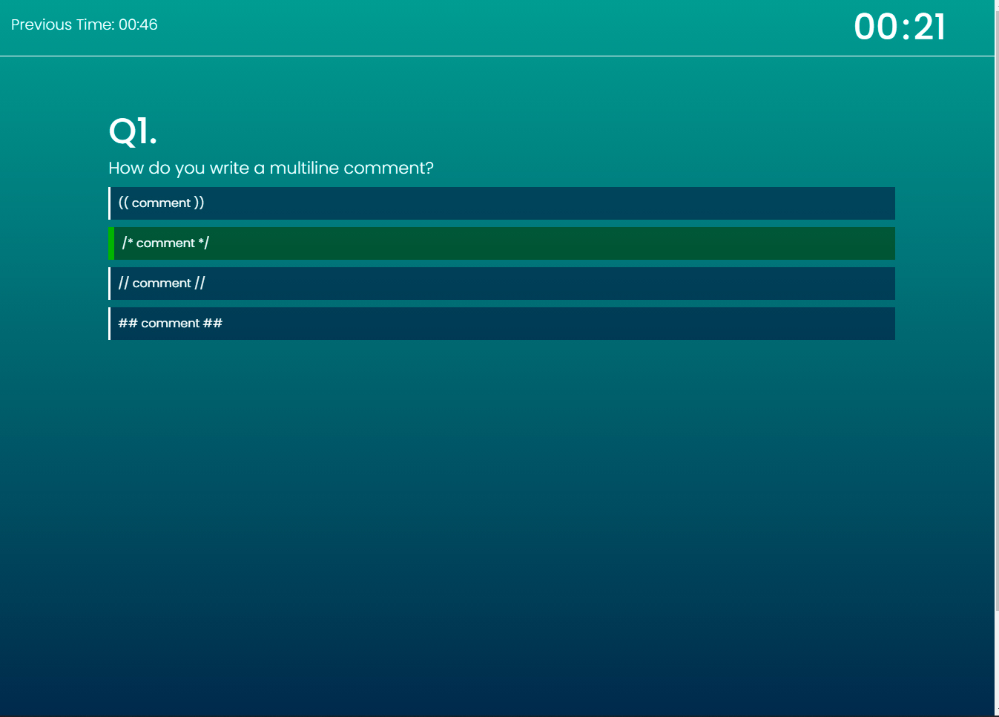
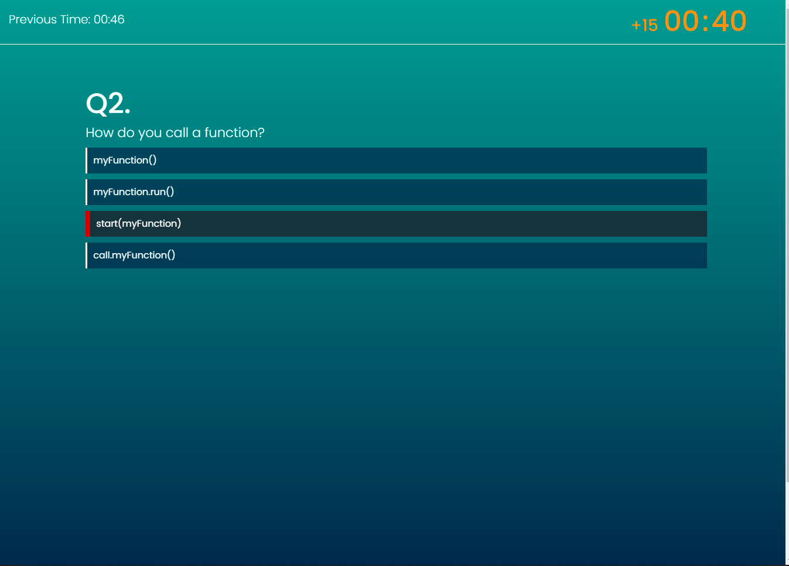
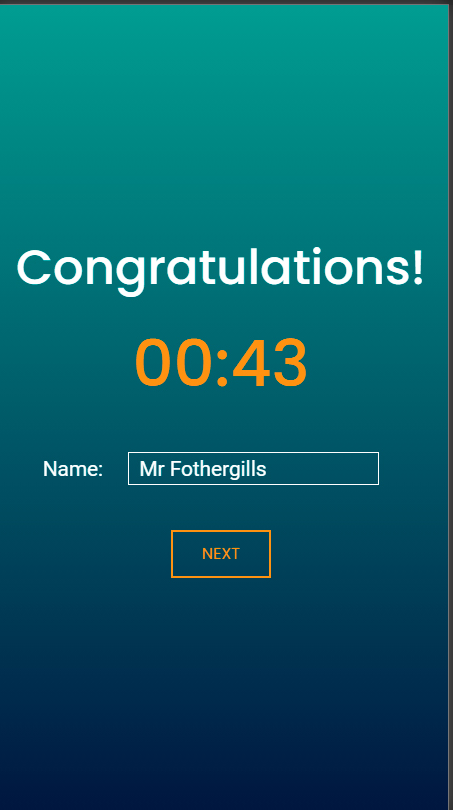

[deployed site](https://nick75mowbray.github.io/wk4_jsquiz/)
## Overview
This is website that uses javascript to create an interactive multiple choice quiz.
### features
All content is part of one page (index.html) for faster loading and smoother transitions between sections.\
The questions slide in and out of frame using a bootstrap carousel with some added features to delay the transition and ensure it only slides if a answer is selected.\
If a wrong question is selected the timer will turn orange for 2 seconds and 15 seconds will be added to the time.\
In the navbar is a display of the previous time which is stored in local storage so that it remains accurate even if the page is reloaded.\
The name and score of the user is added to local storage and shown on the page alongside all other names and scores.
## screenshots

